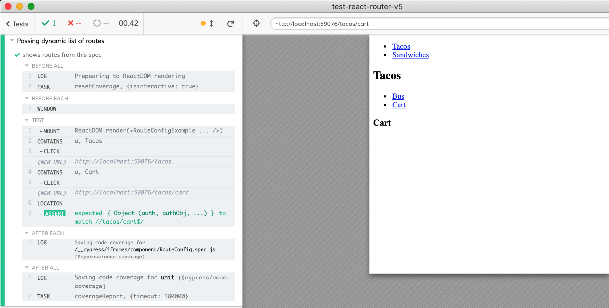

# test-react-router-v5
> Component tests for apps that use [React Router v5](https://reacttraining.com/react-router/web/guides/quick-start)

 

Uses [cypress-react-unit-test](https://github.com/bahmutov/cypress-react-unit-test)

- [src/App.spec.js](src/App.spec.js) shows basic routing
- [src/Nesting.spec.js](src/Nesting.spec.js) shows two level of routing
- [src/Auth.spec.js](src/Auth.spec.js) takes protected routes for a spin
- [src/RouteConfig.spec.js](src/RouteConfig.spec.js) passes the list of routes from the test to the component to render



## Common problems

<details>
  <summary>Cannot read property 'location' of undefined</summary>
  If the test fails with this error from `useContext(Context).location` line, you have probably forgotten to surround the mounted route with the `BrowserRouter` component.

```js
import { BrowserRouter } from 'react-router-dom'
// then in the test mount the component the same way
// as you would in the "normal" mini web application
// AuthenticatedRoute and NewNote are user code we want to test
mount(
  <BrowserRouter>
    <AuthenticatedRoute>
      <NewNote />
    </AuthenticatedRoute>
  </BrowserRouter>
)
```

See [cypress-react-unit-test#388](https://github.com/bahmutov/cypress-react-unit-test/issues/388) for example

</details>

<details>
  <summary>Cannot read property '...' of null</summary>
  If the components inside the route rely on a context, surround the routes with appropriate context provider.

```js
// AuthenticatedRoute.js
export default function AuthenticatedRoute({ children, ...rest }) {
  const { isAuthenticated } = useAppContext();
  ...
}
// test file
mount(
  <BrowserRouter>
    <AppContext.Provider value={{ isAuthenticated: true, userHasAuthenticated: true }}>
      <AuthenticatedRoute>...</AuthenticatedRoute>
    </AppContext.Provider>
  </BrowserRouter>
)
```

See [cypress-react-unit-test#388](https://github.com/bahmutov/cypress-react-unit-test/issues/388) for example
</details>
